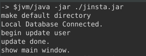

# jinsta-watchdog v2
### Monitor Instagram profile picture  

before start : 
1- add usernames to ./username.txt 
2- login to instagram account and copy all Cookies to ./info.conf [as one line ; ] 
3- run terminal/cmd -> java -jar jinsta.jar 
   

